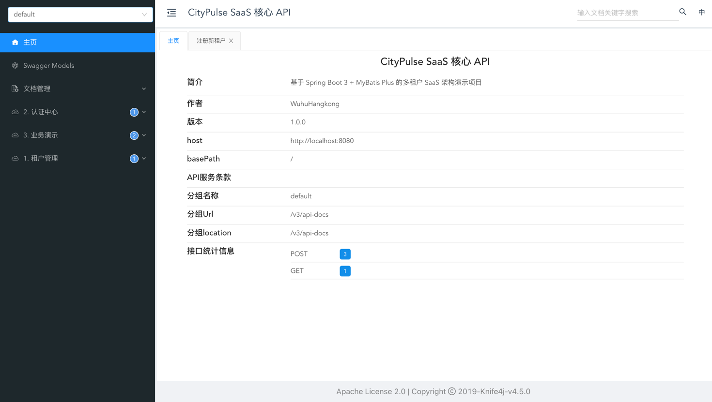

# 🚀 Open SaaS Core

> 一个基于 Spring Boot 3 + MyBatis Plus 的轻量级、多租户 SaaS 核心架构脚手架。

## 📖 项目介绍

Open SaaS Core 是一个开箱即用的 SaaS 后端基础设施。它旨在解决 SaaS 开发中最核心的痛点——**多租户数据隔离**与**身份识别**。

开发者只需关注业务逻辑，无需在每个 SQL 中手动添加 `WHERE tenant_id = ?`，系统会在底层自动完成数据隔离、上下文传递和审计字段填充。

## ✨ 核心特性

* **🛡️ 隐形多租户隔离**：基于 MyBatis Plus 拦截器实现行级（Row-Level）数据隔离，业务代码零感知。
* **🔌 租户上下文透传**：通过 `TenantSecurityFilter` 和 `ThreadLocal` 实现请求全链路的租户身份传递。
* **⚡ 智能字段填充**：自动填充 `tenant_id`、`create_time`、`update_time`，彻底告别重复代码。
* **🏢 租户生命周期管理**：提供租户注册、开通、禁用等标准管理接口。
* **🔐 基础用户认证**：实现了基于租户维度的用户登录体系。

## 🛠️ 技术栈

* **核心框架**: Spring Boot 3.4.2
* **ORM 框架**: MyBatis Plus 3.5.7
* **数据库**: PostgreSQL
* **工具库**: Lombok, FastJSON (可选)
* **构建工具**: Maven

## 🚀 快速开始


### 🐳 方式一：Docker 一键启动 (推荐)
无需安装 Java 或 PostgreSQL，直接运行：

```bash
# 1. 编译打包
./mvnw clean package -DskipTests

# 2. 启动服务
docker-compose up -d
```
启动成功后，即可访问：

📄 在线接口文档 (Knife4j): http://localhost:8080/doc.html

🛢️ 数据库端口: localhost:5434 (默认账号: postgres / 密码: password)

### ☕️ 方式二：本地开发运行
### 1. 环境准备
确保本地已安装：
* JDK 21
* PostgreSQL 14+
* Maven 3.x

### 2. 数据库初始化
请在 PostgreSQL 中执行以下 SQL 脚本以初始化表结构：

```sql
-- 1. 租户管理表 (全局表，不隔离)
CREATE TABLE sys_tenant (
    id BIGSERIAL PRIMARY KEY,
    name VARCHAR(100) NOT NULL,
    status VARCHAR(20) DEFAULT 'NORMAL',
    create_time TIMESTAMP,
    update_time TIMESTAMP
);

-- 2. 用户表 (多租户隔离)
CREATE TABLE sys_user (
    id BIGSERIAL PRIMARY KEY,
    username VARCHAR(50) NOT NULL,
    password VARCHAR(100) NOT NULL,
    email VARCHAR(100),
    tenant_id VARCHAR(50) NOT NULL,
    create_time TIMESTAMP,
    update_time TIMESTAMP
);

-- 3. 业务演示表：商品 (多租户隔离)
CREATE TABLE product (
    id BIGSERIAL PRIMARY KEY,
    name VARCHAR(100) NOT NULL,
    price DECIMAL(10, 2) NOT NULL,
    tenant_id VARCHAR(50) NOT NULL,
    create_time TIMESTAMP,
    update_time TIMESTAMP
);
```

### 3. 运行项目
修改 application.properties 中的数据库连接信息，然后运行 OpenSaasCoreApplication

## 🔌 API 接口文档

本项目集成了 **Knife4j** (基于 Swagger 3)，提供可视化的在线 API 文档与调试界面。



> 启动项目后，访问：`http://localhost:8080/doc.html` 即可进入在线文档。

### 核心接口预览（手动测试指南）

如果你不方便运行 Docker 或前端，也可以使用 Postman 调用以下核心接口：

### 1. 租户管理
* **注册新租户**
    * `POST /api/tenants/register`
    * Body: `{"name": "字节跳动"}`
    * *无需 Header*

### 2. 用户认证
* **用户登录**
    * `POST /api/auth/login`
    * Header: `X-Tenant-ID: {tenantId}`
    * Body: `{"username": "admin", "password": "..."}`

### 3. 业务测试 (商品)
* **查询商品** (自动隔离)
    * `GET /test/products`
    * Header: `X-Tenant-ID: {tenantId}`
* **新增商品** (自动填充租户ID)
    * `POST /test/products/add`
    * Header: `X-Tenant-ID: {tenantId}`
    * Query: `name=可乐&price=3.5`

## 🤝 贡献指南
欢迎提交 Issue 和 Pull Request！

## 📄 开源协议
MIT License
